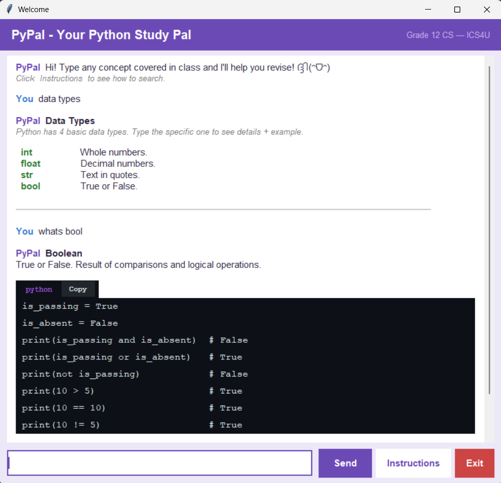

# PyPal - Your Python Study Pal
PyPal is a revision chatbot designed to help ICS4U students master Python concepts. Built using Python's `tkinter` library, it acts as an interactive cheat sheet by providing instant definitions, logical overviews, and code examples for a wide range of topics taught in class, from basic data types to OOP principles.
 
## Project Overview

## Features
* **Hierarchical Keyword Search**
  - **Category Search:** Enter a broad category (for example, `data structures`) to receive an overview of all sub-topics.
  - **Topic Search:** Enter a specific term (for example, `bool` or `bubble sort`) for a detailed definition and code example.
* **Intuitive UI:** A clean, navy-themed interface with buttons for `Send`, `Instructions`, and `Exit`.
* **Code Snippet Integration:** Every code example includes a built-in **Copy** button, allowing students to instantly test snippets in their own IDE.
* **Terminal-Style Commands:** Supports direct commands typed in the chat bar:
 
  | Command | Description |
  |---------|-------------|
  | `help`  | Displays navigation instructions |
  | `clear` | Wipes the current chat history for a fresh start |
  | `exit`  | Safely exits the application |
 
- **Error Handling:** Displays a friendly *"keyword not found"* message to guide users back to supported topics.
- **Regex Matching:** Uses Python's `re` module with `\b` anchors to catch partial inputs like `"bubble"` matching `"bubble sort"`, while preventing false matches.

 
## Supported Topics
 
| Category            | Specific Topics                                        |
|---------------------|--------------------------------------------------------|
| Data Types          | `int`, `float`, `str`, `bool`                          |
| Control Flow        | `if`, `for loop`, `while loop`                         |
| User-Defined Functions | `functions`, `scope`, `recursion`                   |
| Libraries           | `math`, `random`, `numpy`                              |
| Searching Algorithms| `linear search`, `binary search`                       |
| Sorting Algorithms  | `bubble sort`, `selection sort`, `insertion sort`      |
| Data Structures     | `list`, `tuple`, `dictionary`, `set`, `stack`, `queue` |
| OOP                 | `class`, `inheritance`, `encapsulation`, `polymorphism` |
| Other               | `variables`, `operators`, `big o notation`              |
 

## Try it out!
1. Download `pypal.py` from this repository.
2. Launch the app and type any CS concept into the input box and click Send (or simply press Enter).
3. Click Instructions if you get lost on which keywords to search.
4. Use the Copy button to grab a code snippet and paste it into your own editor to see how it runs.
5. Use the Clear command or the clear button to wipe the history and start a new revision session.
6. Type quit or hit the Exit button to close the app when you're done studying.

 
